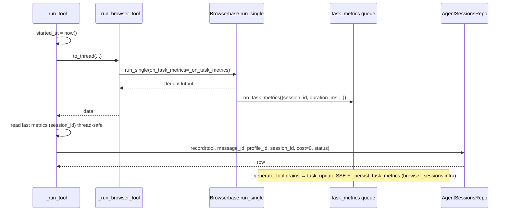
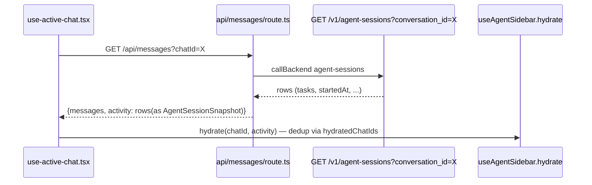

# Design: Session Telemetry Fixes

## Technical Approach

Backend-owned `agent_sessions` telemetry written **post-run in `chat.py`** (one row per tool run, engine + browser), consumed by a new API/BFF and the existing hydrate hook; delete becomes tombstone-backed so upserts can never resurrect; ThemeProvider moves from the root layout into `(chat)`. Maps to proposal approach A1+B1+2+C1 and specs AST/CD/LLT. Coordinates with the merged `browser-tools-streaming` design: `_run_tool` in `chat.py` is the single convergence point and stays untouched in its event framing.

## Architecture Decisions

### ADR-1 — `agent_sessions` coexists with `browser_sessions` (split documented)

| Option | Tradeoff | Decision |
|---|---|---|
| Unify into `agent_sessions` | Kills context-reuse lifecycle; migration of live rows; риск to Browserbase reuse | Rejected — `browser_sessions` is infra state (context reuse, `active↔in_use`, expires) |
| **Coexist, documented split** | Two tables; both written on browser runs | **Chosen** — `agent_sessions` = user-facing telemetry for engine AND browser runs; `browser_sessions` keeps its infra role. Both write on browserbase runs: `_persist_task_metrics` (infra) + `_persist_agent_session` (telemetry). No double-write of the same data; different concerns. |

### ADR-2 — `on_task_metrics` contract repaired via port, persistence never callback-dependent

| Option | Tradeoff | Decision |
|---|---|---|
| Drop the callback everywhere | Browserbase would lose real session_id/duration for infra reuse | Rejected |
| **Port declares it; all providers accept** | composio/mock accept-and-ignore; Browserbase honors | **Chosen** — add `on_task_metrics` to `BrowserRunnerPort.run_single` + composio.py/mock.py optional kwarg. Dispatch keeps passing it; `agent_sessions` write is post-run backend-owned (AST-2) so composio/mock loses nothing. No `TypeError` for any provider. |

### ADR-3 — Persistence point = `_run_tool` (both branches converge)

| Option | Tradeoff | Decision |
|---|---|---|
| Persist inside providers | Callback drift returns; engines have no provider | Rejected |
| **`_run_tool` after `asyncio.to_thread` returns** | One write site per run | **Chosen** — `_persist_agent_session(fastapi_request, ...)` best-effort (mirrors `_persist_conversation`: never breaks SSE). `started_at` captured before dispatch ("Comenzó"), `completed_at` after; duration = round-trip. Browserbase `session_id` from the drained `task_metrics` payload (thread-safe last-write holder on the sync callback); composio `session_id` + task count come from the provider telemetry APIs (see ADR-7); mock keeps NULL. Status: `completed` | `error` from `data.get('error')`. Existing stream events untouched. |

### ADR-4 — "Acciones" = tasks JSONB, canonical 7-task template for consultaarca

| Option | Tradeoff | Decision |
|---|---|---|
| Frontend-only template | Backend can't build JSONB | Rejected |
| **Backend Python constant, TS synced** | Duplication across languages | **Chosen** — new `domain/session_tasks.py` (`DEFAULT_TASKS_BY_TOOL`): consultaarca = 7 tasks (`task-0..6`, labels from `buildSubtasksForTool` — currently 5, extended to 7 in `backend/ai/tools/agent-execution.ts` to match spec AST-3). Final status per task = `completed`/`error` (success/failed run). Page renders count/last label under new "Acciones" i18n header. |

### ADR-5 — Delete = tombstone (`deleted_at`), honest 404, no-create title patch

| Option | Tradeoff | Decision |
|---|---|---|
| Pure hard delete (spec literal) | Upsert can't distinguish "deleted" from "never existed" → CD-2 "upsert refused" impossible | Rejected |
| **Tombstone `deleted_at` on conversations** | Rows retained (purge later = admin op) | **Chosen** — DELETE sets `deleted_at`; list/get/delete-all filter `deleted_at IS NULL`; second DELETE → 404; `upsert_conversation` returns None when tombstoned (stream surfaces "missing conversation"); new `PATCH /v1/conversations/{id}` (title-only, never creates) replaces BFF `saveConversation` POST. Behavior matches every CD scenario; "hard-delete" interpreted as row-state gone, since only a tombstone makes no-resurrect enforceable. New-chat title timing verified: stream persists first (`_persist_conversation` pre-`complete`), BFF title save runs after stream end → PATCH always follows an existing row; deleted chat → 404 logged, no create. |

### ADR-6 — ThemeProvider scoped to `(chat)`; landing light by absence

| Option | Tradeoff | Decision |
|---|---|---|
| Root provider + `.light` wrapper on landing | Fights next-themes class on `<html>`; flash risk | Rejected |
| **Move provider into `(chat)/layout.tsx`; landing layout unchanged (no provider)** | Toggle unavailable on landing (not needed) | **Chosen** — with no provider mounted, `document.documentElement` never gets `.dark` on landing routes; `@custom-variant dark (&:is(.dark, .dark *))` never matches → landing always light, zero flash. Chat keeps `attribute="class" defaultTheme="system" enableSystem disableTransitionOnChange` around `SidebarShell`; toggle (`sidebar-user-nav`, `sheet-editor`) unchanged. `/embed/*` routes: **none exist** → out of scope per proposal. Verify legacy RGB media-query vars (globals.css L234) don't affect landing semantic tokens (visual check only). |

### ADR-7 — Composio telemetry via provider APIs (Logs + Usage)

| Option | Tradeoff | Decision |
|---|---|---|
| Keep composition of NULL session_id for composio | Loses session ids and real action counts; spec AST-4 under-delivers | Rejected |
| **Query Composio Logs API + Usage API** | Extra provider call after run; needs API key (already present) | **Chosen** — after a composio browser run, the backend queries the provider's own telemetry endpoints (base `https://backend.composio.dev/api/v3.1`, same key the adapter already uses at `composio.py:62`; `Authorize: Bearer` header per `_create_task`): (1) **Logs API** `POST /api/v3.1/logs/tool_execution` filtered by the Browser Tool slug and the run's time window (`timings.start_time`/`end_time` epoch ms) → read `session_id`/`context.session_id` from matching records; (2) **Usage API** `POST /api/v3.1/project/usage/tool_calls` (or `org/usage/summary` per scope) filtered by the same window/session → aggregated `event_count` as the real "Acciones"/task count. Best-effort: any provider-network failure keeps the row with `session_id NULL` and whatever task count we have locally; telemetry must never break the SSE stream (same policy as AST-2). Mock provider → not called, NULL. |

## DB Schema — `agent_sessions` (migration `0007`, down_revision `'0006'`)

```sql
CREATE TABLE agent_sessions (
  id UUID PRIMARY KEY,                       -- UuidPkMixin (client uuid4, matches 0005)
  tool VARCHAR(64) NOT NULL,                 -- tool_key, e.g. 'consultaarca'
  message_id VARCHAR(255) NULL,              -- opaque frontend message id; NO FK
  conversation_id VARCHAR(255) NULL,         -- frontend opaque chat id (hydrate needs it)
  profile_id UUID NULL REFERENCES profiles(id) ON DELETE SET NULL,  -- engines: NULL (AST-1)
  tenant_id UUID NOT NULL REFERENCES tenants(id) ON DELETE CASCADE,
  user_id UUID NULL REFERENCES users(id) ON DELETE SET NULL,        -- None for API keys
  session_id VARCHAR(255) NULL,              -- provider session id (AST-4); engines NULL, composio via Logs API (ADR-7)
  status VARCHAR(32) NOT NULL DEFAULT 'completed'
    CHECK (status IN ('running','completed','error')),
  tasks JSONB NOT NULL DEFAULT '[]',         -- 7 defaults for consultaarca (AST-3)
  cost_cents INTEGER NOT NULL DEFAULT 0,
  started_at TIMESTAMPTZ NULL,               -- "Comenzó" (AST-3)
  completed_at TIMESTAMPTZ NULL,             -- duration = completed - started
  created_at TIMESTAMPTZ NOT NULL DEFAULT now(),
  updated_at TIMESTAMPTZ NOT NULL DEFAULT now()
);
CREATE INDEX ix_agent_sessions_tenant_created ON agent_sessions (tenant_id, created_at DESC);
CREATE INDEX ix_agent_sessions_conversation  ON agent_sessions (conversation_id);
CREATE INDEX ix_agent_sessions_profile       ON agent_sessions (profile_id);
ALTER TABLE conversations ADD COLUMN deleted_at TIMESTAMPTZ NULL;
```
Every column nullable/defaulted → existing flows never break writes (AST-1 scenario 2). Reversible downgrade drops table + column.

## Sequence Diagrams

Engine consultaarca write:

```mermaid
sequenceDiagram
  participant BFF as api/chat/route.ts
  participant S as chat_message_stream
  participant T as _run_tool
  participant E as _run_engine_tool
  participant R as AgentSessionsRepo
  BFF->>S: POST /v1/chat/message/stream (conversation_id, message_id)
  S->>T: tool_key=consultaarca
  T->>T: started_at = now()
  T->>E: to_thread(_run_engine_tool)
  E-->>T: data (padrón dict)
  T->>T: status = error? 'error':'completed'; tasks = 7 defaults(completed)
  T->>R: record(tool, message_id, conversation_id, None, session_id=None, cost=0, started, completed)
  R-->>T: row
  T-->>S: complete event (reply,data)
  S-->>BFF: SSE complete
```

Browser write with provider session id:



Delete end-to-end:

```mermaid
sequenceDiagram
  participant U as sidebar-history.tsx
  participant B as api/chat/route.ts
  participant BK as /v1/conversations/{id}
  participant R as conversation_repo
  U->>B: DELETE /api/chat?id=X (await)
  B->>BK: DELETE /v1/conversations/X
  BK->>R: delete_conversation → deleted_at=now()
  R-->>BK: deleted=true → 204
  BK-->>B: 204
  B-->>U: {success:true}
  U->>U: mutate (row gone); active chat → router push "/"
  Note over U,B: second delete: BK → 404 → BFF {success:false, deleted:false} → toast error, no success
  Note over BK: later turn on X: upsert → tombstoned → None → stream surfaces missing-conversation
```

Hydrate-from-backend:



## File Changes

| File | Action | Description |
|---|---|---|
| `backend/alembic/versions/0007_agent_sessions_deleted_at.py` | Create | Table + `conversations.deleted_at` |
| `backend/agente_fiscal/db/models/business.py` | Modify | `AgentSession` ORM; `deleted_at` on Conversation |
| `backend/agente_fiscal/domain/session_tasks.py` | Create | `DEFAULT_TASKS_BY_TOOL` (7 consultaarca), `build_session_tasks(tool, status)` |
| `backend/agente_fiscal/ports/agent_sessions.py` | Create | `AgentSession` pydantic + `AgentSessionsRepository` protocol |
| `backend/agente_fiscal/adapters/db_agent_sessions.py` | Create | `PostgresAgentSessionsRepository` (record, list) |
| `backend/agente_fiscal/api/routes/agent_sessions.py` | Create | `GET /v1/agent-sessions?conversation_id=&limit=` (tenant/user scoped) |
| `backend/agente_fiscal/api/routes/chat.py` | Modify | `_persist_agent_session`; `_run_tool` write point + started_at; `_on_task_metrics` last-metrics holder; tombstoned upsert → missing-conversation result; accept `message_id` |
| `backend/agente_fiscal/ports/browser.py` | Modify | `run_single` declares `on_task_metrics` |
| `backend/agente_fiscal/adapters/browser/composio.py`, `mock.py` | Modify | Accept + ignore optional `on_task_metrics` |
| `backend/agente_fiscal/adapters/browser/composio_telemetry.py` | Create | `fetch_provider_session_id(...)` (Logs API `POST /api/v3.1/logs/tool_execution`, filter tool slug + time window, read `session_id`/`context.session_id`) + `fetch_provider_action_count(...)` (Usage API `POST /api/v3.1/project/usage/tool_calls`, filter window, read `event_count`); best-effort, never raises through telemetry path; same API key/base URL as `composio.py` |
| `backend/agente_fiscal/db/conversation_repo.py` | Modify | `delete_conversation`→tombstone; filters exclude deleted; `upsert_conversation` refuses tombstoned; new `patch_conversation_title` |
| `backend/agente_fiscal/api/routes/conversations.py` | Modify | DELETE 404 on missing/already-deleted; `PATCH /v1/conversations/{id}` (title, no-create) |
| `frontend/app/(chat)/api/agent-sessions/route.ts` | Create | BFF proxy GET |
| `frontend/lib/backend/agent-sessions.ts` | Create | Server-only typed helper |
| `frontend/hooks/use-agent-sessions.ts` | Create | SWR hook (page + merge live sessions) |
| `frontend/app/(chat)/agent-sessions/page.tsx` | Modify | Consume backend rows; "Acciones" column (tasks count/last label); `—` for NULL session/profile |
| `frontend/app/(chat)/api/chat/route.ts` | Modify | DELETE 404 → `{success:false,deleted:false}`; `saveConversation`→PATCH; stream body + `message_id`; title save after complete (unchanged timing) |
| `frontend/lib/backend/conversations.ts` | Modify | `deleteConversation` returns `{deleted}` on 404; `patchConversationTitle` |
| `frontend/components/chat/sidebar-history.tsx` | Modify | `await` DELETE; error toast; reconcile on failure; navigate when active |
| `frontend/app/(chat)/api/messages/route.ts` | Modify | `activity` from agent-sessions (conversation_id) |
| `frontend/i18n/dictionary.ts` | Modify | `acciones` key (es/en) + headers |
| `backend/ai/tools/agent-execution.ts` | Modify | `SUBTASK_TEMPLATES.consultaarca` → 7 labels |
| `frontend/app/layout.tsx` | Modify | Remove `<ThemeProvider>` (keep scripts, Language/Clerk providers) |
| `frontend/app/(chat)/layout.tsx` | Modify | Wrap `SidebarShell` in `<ThemeProvider attribute="class" defaultTheme="system" enableSystem disableTransitionOnChange>` |
| `backend/tests/test_agent_sessions.py`, `test_conversation_deletion.py` | Create | Pytest: AST/CD scenarios |
| `backend/tests/test_chat_stream.py` | Modify | FakeBrowser mirrors real signature; assert agent_sessions row |
| `frontend/playwright/telemetry-delete-theme.spec.ts` | Create | E2E: reload persistence, delete flow, theme scoping |

## Interfaces / Contracts

```python
# ports/agent_sessions.py
class AgentSession(BaseModel):
    id: str; tool: str; message_id: str | None; conversation_id: str | None
    profile_id: str | None; tenant_id: str; user_id: str | None
    session_id: str | None; status: str; tasks: list[dict]
    cost_cents: int; started_at: datetime | None; completed_at: datetime | None

class AgentSessionsRepository(Protocol):
    async def record(self, session: AgentSession) -> None: ...
    async def list_for(self, *, tenant_id: UUID, user_id: UUID | None,
                       role: str, conversation_id: str | None,
                       limit: int = 100) -> list[AgentSession]: ...

# chat.py write point (best-effort, never breaks SSE — mirrors _persist_conversation)
async def _persist_agent_session(req: Request, *, tool: str, message_id: str | None,
    conversation_id: str | None, profile_id: UUID | None, session_id: str | None,
    status: str, tasks: list[dict], started_at: datetime, completed_at: datetime) -> None

# conversation_repo.py
async def patch_conversation_title(session, tenant_id, conversation_id, title) -> bool  # no-create
async def upsert_conversation(...) -> UUID | None   # None when tombstoned
```

Canonical consultaarca tasks JSONB (7, `task-0..6`, status `completed` on success): `Authenticating with ARCA gateway`, `Fetching taxpayer profile`, `Retrieving tax obligations`, `Validating response schema`, `Consulting payment obligations`, `Cross-checking due dates`, `Formatting output` — mirrored into `SUBTASK_TEMPLATES['consultaarca']`.

## Testing Strategy

| Layer | What | How |
|---|---|---|
| Backend pytest | AST-1 migration applies + downgrades; AST-2 one row per run (engine + browser); AST-3 7 tasks/empty ids/cost 0; AST-5 no TypeError for composio/mock signatures; ADR-7 provider calls mocked (httpx/respx: Logs API returns session_id, Usage API returns event_count; failure → NULL + local count); CD-1..3 tombstone/404/patch | `uv run pytest` (fastapi TestClient + fakeredis; monkeypatch `PROVIDERS['composio']` + fake `session_factory` per `test_chat_stream` precedent) |
| Frontend vitest | `buildSubtasksForTool('consultaarca')` length 7; agent-sessions type mapping | `pnpm test:unit` |
| E2E Playwright | CD-4 sidebar flow; LLT-1..3 (landing light under `colorScheme:'dark'`, chat toggle, no-flash); AST-6 reload persistence | `pnpm test` |
| Composio smoke w/o creds | Dispatch path with REAL `ComposioBrowser` signature (now accepting callback) — no API call made unless tool runs; full path per `SMOKE-INTEGRATIONS.md` w/ creds | pytest + manual |

## Threat Matrix

N/A — no routing, shell, subprocess, VCS/PR automation, executable-file classification, or process-integration boundary; all changes are HTTP app logic, DB schema, and React layout.

## Migration / Rollout

No data migration (append-only table + nullable column); no feature flags. Chained PRs under the 400-line budget: **P1a — backend telemetry** (migration, model, session_tasks, port/repo, endpoint, `chat.py` writes, TypeError contract, deletions repo/tests); **P1b — frontend consume** (BFF agent-sessions, messages activity, page + i18n + hooks, TS template sync, tests); **P2 — deletion** (backend tombstone+PATCH, BFF delete/title, sidebar, tests); **P3 — theme** (layouts + e2e). Rollback = revert one slice.

## Open Questions

- [x] Composio `session_id` — resolved by ADR-7: backend queries provider Logs API (`POST /api/v3.1/logs/tool_execution`, filter Browser Tool slug + run time window, read `session_id`/`context.session_id`) and Usage API (`POST /api/v3.1/project/usage/tool_calls` → `event_count` as real task count). Best-effort only: on provider/network failure the row persists with `session_id NULL` and the local task template count.
- [ ] Purge policy for tombstoned conversations (out of scope; future admin op).

## Verification Approach

- Backend: `uv run pytest` (unit + TestClient integration).
- Frontend: `pnpm test:unit` (vitest), `pnpm exec playwright test` (e2e).
- Composio path without real creds: contract-level pytest on `run_single` signatures proves no `TypeError`; real smoke only with creds (documented in `SMOKE-INTEGRATIONS.md`).